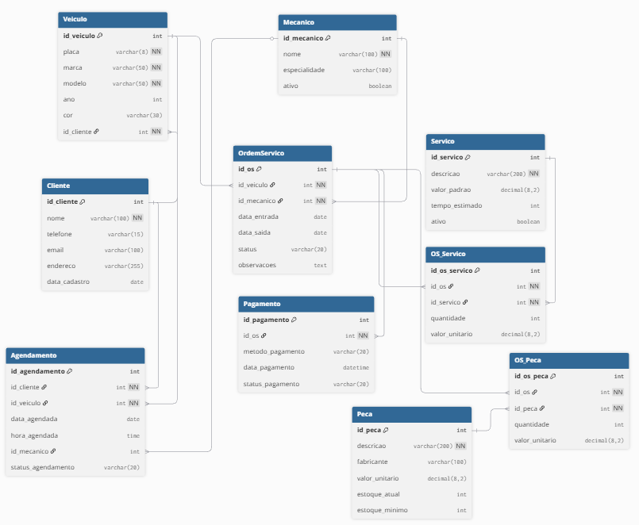

# Projeto Sistema de manutenção de veículos

Este projeto consiste na criação de um modelo físico de um banco de dados para um sistema manutenção de veículos.
O projeto foi desenvolvido em Typescript com Nodejs.

## Frontend
O frontend utiliza [React](https://pt-br.legacy.reactjs.org/) e [TailwindCss](https://tailwindcss.com/) para a interface visual, utilizando o bundler [Vite](https://vite.dev/)

## Backend
O backend utiliza [Express](https://expressjs.com/pt-br/) para abstração de criação de interface HTTP, e [node-mssql](https://tediousjs.github.io/node-mssql/) para a conexão com o banco de dados.
Localmente o backend é hosteado utilizando [Docker](https://www.docker.com/) e [Docker Compose](https://docs.docker.com/compose/)

## Integrantes
AGNES PINHEIRO PEREIRA - [AgnesPPereira]([url](https://github.com/AgnesPPereira)) 
EVANDRO LUIZ RODRIGUES DAMAZIO - [evandroluizrd]([url](https://github.com/evandroluizrd))  
ISMAEL DAMASCENO TRISTÃO - [IsmaelDamasceno]([url](https://github.com/IsmaelDamasceno)) 
LEONARDO DA CRUZ RAMOS - [leoleojogos]([url](https://github.com/leoleojogos)) 
GABRIELA DE SOUZA GORRESE - [GabrielaGorrese]([url](https://github.com/GabrielaGorrese)) 

## Modelo Físico
Utilizamos a ferramenta de modelagem de dados [dbdiagram.io](https://dbdiagram.io/) para criação do modelo físico do banco de dados, para posterior exportação dos scripts DDL das tabelas e relacionamentos. 
Arquivo fonte: [Modelo Fisico](modelo_fisico/modelofisico3.0.png). 

  
## Dicionário de Dados
As informações sobre as tabelas e índices foram documentados na planilha [dicionário](dicionario_dados/dicionario_versao_final.xlsx).

## Scripts SQL
Para este projeto foi utilizado o banco de dados [SQL Server]([https://azure.microsoft.com/pt-br/products/azure-sql/database](https://www.microsoft.com/pt-br/sql-server/sql-server-downloads))  

Abaixo, segue os scripts SQL separados por tipo:
+ [Tabelas](scripts/ddl/tabelas)
+ [Índices](scripts/ddl/indices)
+ [Gatilhos](scripts/ddl/gatilhos)
+ [Procedimentos armazenados](scripts/ddl/procedimentos-armazenados)
+ [Funções](scripts/ddl/funcoes)
+ [DML](scripts/dml)

## Código Fonte do CRUD
- Linguagem de Programação typescript. 
- Backend: Framework [Express](https://expressjs.com/pt-br/) para gerenciamendo de rotas HTTP, e [node-mssql](https://tediousjs.github.io/node-mssql/) para comunicação com o banco de dados SQL Server.
- Frontend:
 * Typescript para programação e tipagem mais robusta e segura.
 * Nodejs com Vite e react para implementação visual, e serviço SPA (roteado por react-router).
 * Axios para comunicação com api por meio de requisições HTTP.
 * tsc para transpilação de typescript.

## Execução
### [frontend](crud/frontend)
#### Requisitos
* Node e npm instalados na máquina
--  Verificar instalação do npm: `npm -v`
--  Verificar instalação do node: `node -v`

#### Passos
1. Acesse a pasta do projeto [frontend](crud/frontend): `cd crud/frontend`
1. Na pasta do frontend, execute:
   -- `npm install` Instala as dependências do node
   -- `npm start` Inicia o servidor html

### [backend](crud/backend)
#### Requisitos
* docker daemon e docker maanger
#### Passos
1. Acesse a pasta do projeto [backend](crud/backend): `cd crud/backend`
2. Crie um arquivo .env com as configurações necessárias (confira o [.env.example](crud/backend/.env.example) para ver as variáveis necessárias)
> [!Warning]
> A porta utilizada para o backend (`HTTP_PORT`) precisa ser `3600` já que esta é a utilizada pelo frontend
3. Execute os containers: `docker compose up --build` (inicia o container do backend e banco de dados)
> [!TIP]
> Em distribuições do windows é recomendado rodar o docker dentro do [wsl2](https://learn.microsoft.com/en-us/windows/wsl/about). Para um guia tratuito de instalação do wsl2 e docker no windows, acesse: [wsl2-docker-quickstart](https://github.com/codeedu/wsl2-docker-quickstart)

[Codigo Fonte frontend](crud/frontend)
[Codigo Fonte backend](crud/backend)

### Relatório Final
O relatório final está disponível no arquivo [relatório](relatorio-final/relatório_final_completo.docx).

### Referências Bibliográticas
https://learn.microsoft.com/en-us/sql/linux/quickstart-install-connect-docker?view=sql-server-ver17&tabs=cli&pivots=cs1-bash
https://medium.com/@techworldthink/how-to-install-and-configure-microsoft-sql-server-on-docker-running-on-linux-76b8093bb77f
https://petri.com/sql-server-docker/
https://blog.logrocket.com/express-typescript-node/
https://github.com/codeedu/wsl2-docker-quickstart
https://docs.github.com/en/repositories/managing-your-repositorys-settings-and-features/managing-repository-settings/managing-auto-closing-issues
https://docs.github.com/en/issues/tracking-your-work-with-issues/using-issues/linking-a-pull-request-to-an-issue

