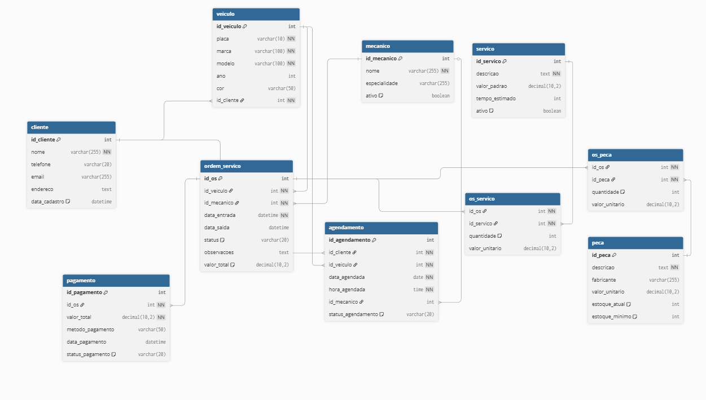

## Projeto Sistema de Atividades Especiais - Sistema de manutenção de veículos

Este projeto consiste na criação de um modelo físico de um banco de dados para um sistema XYZ.
O projeto foi desenvolvido em C# .NET, criando um CRUD para cadastro dos itens xyz, onde a aplicacao faz conexão com o banco de dados através de uma biblioteca chamada entity framework e realiza operações de adição, aualização e deleção dos dados, usando todos os conceitos e dinâmicas práticas de SQL desenvolvidas em aula.

### Integrantes
AGNES PINHEIRO PEREIRA - AgnesPPereira 
EVANDRO LUIZ RODRIGUES DAMAZIO - evandroluizrd  
ISMAEL DAMASCENO TRISTÃO - IsmaelDamasceno 
LEONARDO DA CRUZ RAMOS - leoleojogos 
GABRIELA DE SOUZA GORRESE - GabrielaGorrese 

### Modelo Físico
Utilizamos a ferramenta de modelagem de dados [dbdiagram.io](https://dbdiagram.io/) para criação do modelo físico do banco de dados, para posterior exportação dos scripts DDL das tabelas e relacionamentos. 
Arquivo fonte: [Modelo Fisico](modelo_fisico/modelofisico.png). 

  
### Dicionário de Dados
As informações sobre as tabelas e índices foram documentados na planilha [template1.xlsx](dicionario_dados/template1.xlsx).

### Scripts SQL
Para este projeto foi utilizado o banco de dados [Azure SQL](https://azure.microsoft.com/pt-br/products/azure-sql/database)  
Este é o procedimento para criação do banco de dados Azure SQL [Criando SQL Azure serverless no Azure gratuito - Sem cartão de crédito](https://github.com/jlsilva01/sql-azure-satc).

### Referências Bibliográticas
Site usado para geração do modelo físico: https://dbdiagram.io/

Abaixo, segue os scripts SQL separados por tipo:
+ [Tabelas](scripts/ddl/tabelas)
+ [Índices](scripts/ddl/indices)
+ [Gatilhos](scripts/ddl/gatilhos)
+ [Procedimentos armazenados](scripts/ddl/procedimentos-armazenados)
+ [Funções](scripts/ddl/funcoes)
+ [DML](scripts/dml)

### Código Fonte do CRUD
- Linguagem de Programação typescript. 
- Backend: Framework express para comunicação com o banco de dados PostgreSQL, e gerenciamendo de rotas HTTP
- Frontend: nodejs com <lib-server> e axios para comunicação com api, tsc para transpilação

### Execução ([frontend](crud/frontend))
#### Requisitos
* Node e npm instalados na máquina
--  Verificar instalação do npm: `npm -v`
--  Verificar instalação do node: `node -v`

#### Passos
1. Acesse a pasta do projeto [frontend](crud/frontend): `cd crud/frontend`
1. Na pasta do frontend, execute:
   -- `npm install` Instala as dependências do node
   -- `npm start` Inicia o servidor html

### Execução ([backend](crud/backend))
#### Requisitos
* docker daemon e docker maanger
#### Passos
1. Acesse a pasta do projeto [backend](crud/backend): `cd crud/backend`

[Codigo Fonte frontend](crud/frontend)
[Codigo Fonte backend](crud/backend)

### Relatório Final
O relatório final está disponível no arquivo [relatorio-final/final-report.docx](relatorio/final-report.docx).
